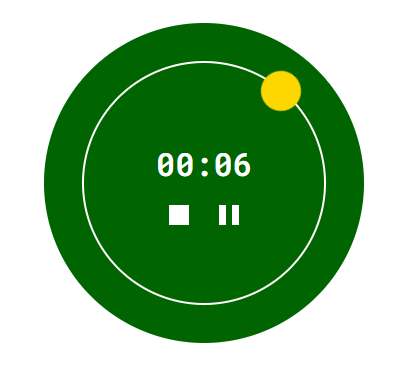

# Cronometro

Este proyecto es una implementación básica de un cronómetro utilizando HTML, CSS y JavaScript.

El cronómetro permite iniciar, pausar y reiniciar la medición del tiempo.

## Screenshots

## 🚀 About Me
I'm a full stack developer...
